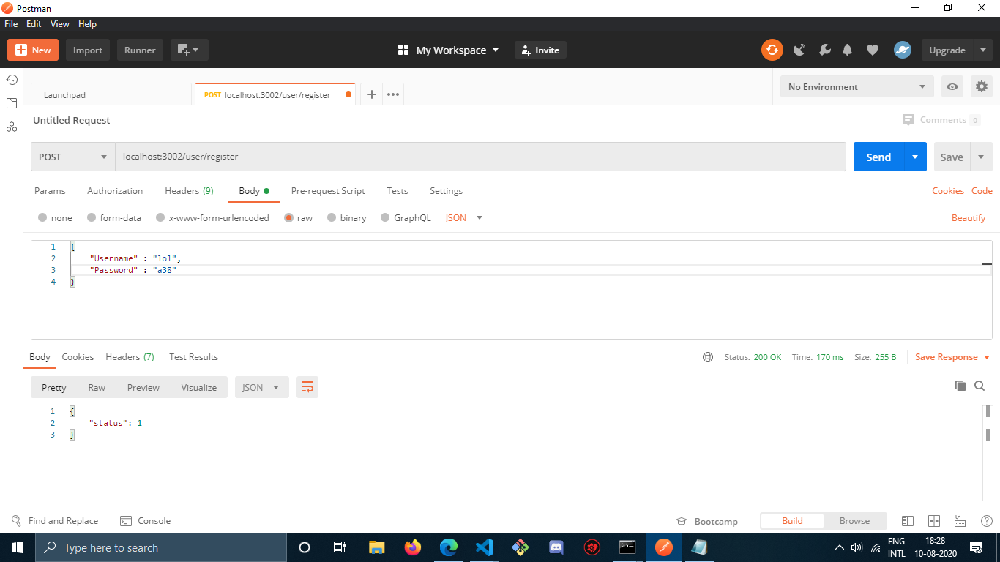

# nosql-api ( Task-1 )
This is an api developed with mongodb, express and nodejs. We can also use hashing to store secured passswords in database as used in my project https://github.com/krishan93985/smart-brain-x1-api
# workflow
-- contains following endpoints,  
1. login API for user \
 -- One collection of docs. named "users" is created in database, \
 checking the existance of given Username, if found then matching the corresponding Password pass {status : 1}, if any fails { status : 2 } 

2. register API for user \
 -- same 'users' collection is used \
 checking the existance of the Username, if not present then creating one with the given credentials

3. & 4. login and register APIs for vendor works in the similar way but the given credentials contains 'mobile' number instead of 'Username' \
 -- One collection of docs. named "vendors" is created in database
 -- Schema has accordingly slightly different properties than users -See "models" folder for Schema

5. gets a list of items for the vendor 
Same list is sent for all vendors cause no specific details were given to relate any list of items to specific shopkeeper, body was asked to be _EMPTY_, and response were also fixed as given in the "Task-1", otherwise an 'id' could be sent as a response to vendor during successful registration which when tries to get the list will get their specific list of items, submitted by vendors during registration

